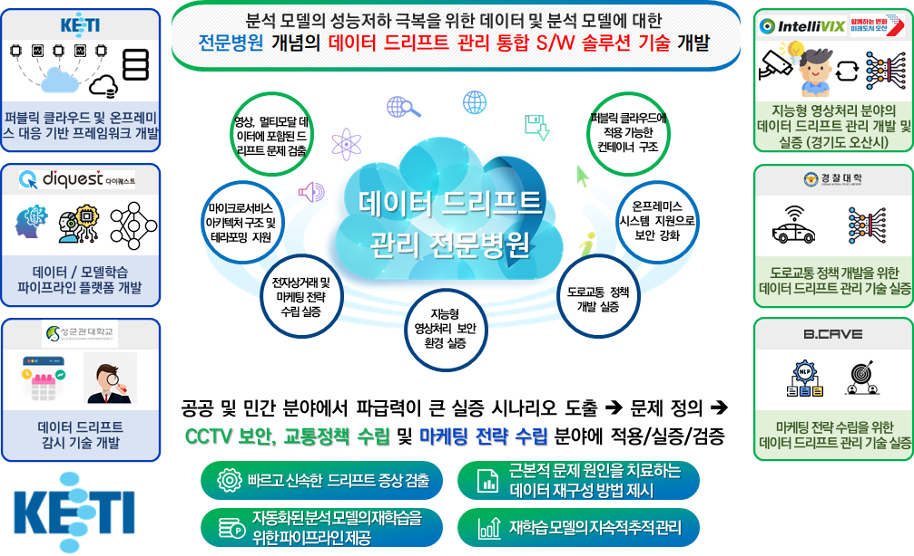

# 분석 모델의 성능 저하 문제를 극복하는 데이터 드리프트 관리 기술 

## 개요

- 통합 솔루션 (DataDrift Management Solution)
- 데이터 드리프트 통합 관리 솔루션입니다.
- 종합 검토 기관 : 한국전자기술연구원(KETI)

## 성과요약
- 과제설명 및 성과공유 github [바로가기](https://github.com/keti-datadrift/goal_of_datadrift)

## 개념도

## Acknowledgements (사사)
- 이 연구는 2024년도 정부(과학기술정보통신부)의 재원으로 정보통신기획평가원의 지원을 받아 수행된 연구임 (No. RS-2024-00337489, 분석 모델의 성능저하 극복을 위한 데이터 드리프트 관리 기술 개발)
- This work was supported by Institute of Information & communications Technology Planning & Evaluation (IITP) grant funded by the Korea government(MSIT) (No. RS-2024-00337489, Development of data drift management technology to overcome performance degradation of AI analysis models)
